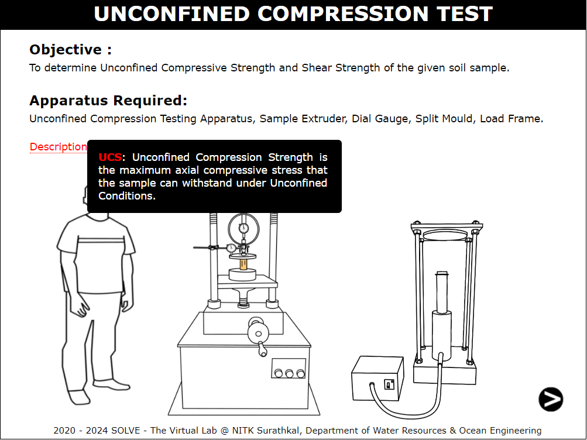
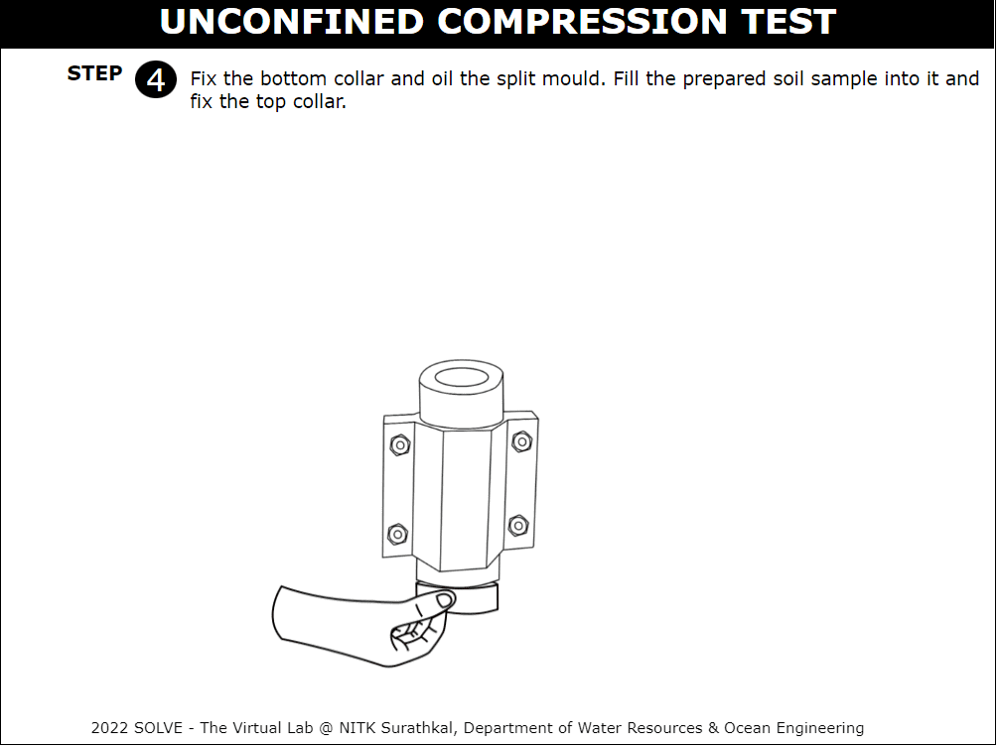
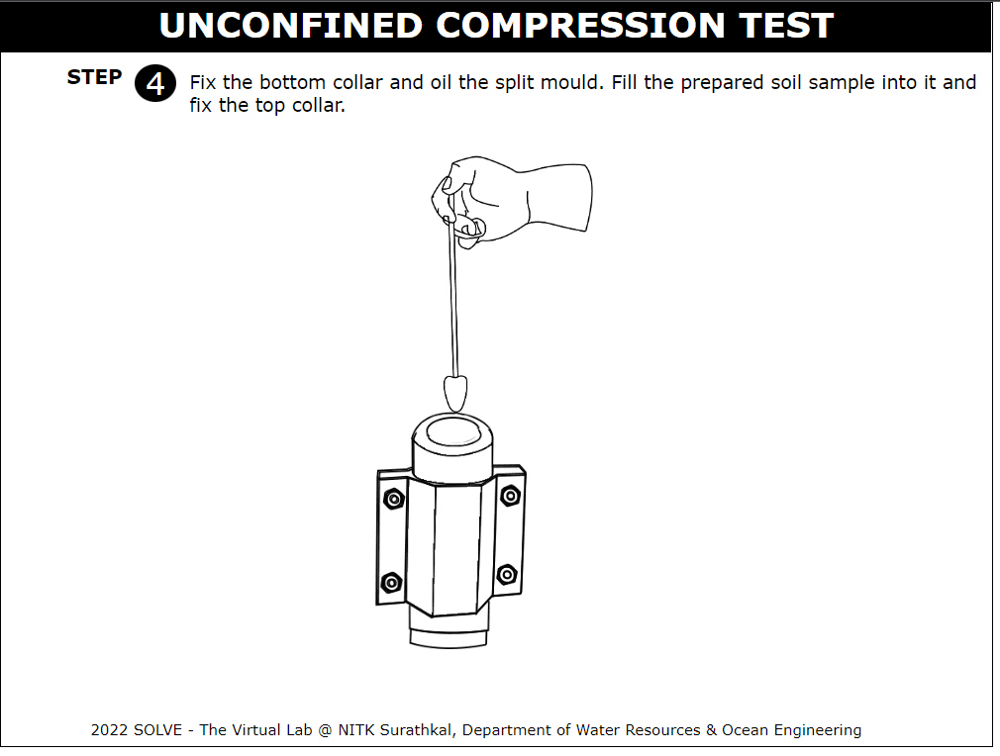
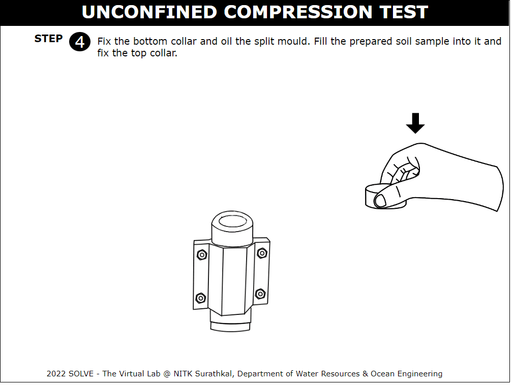
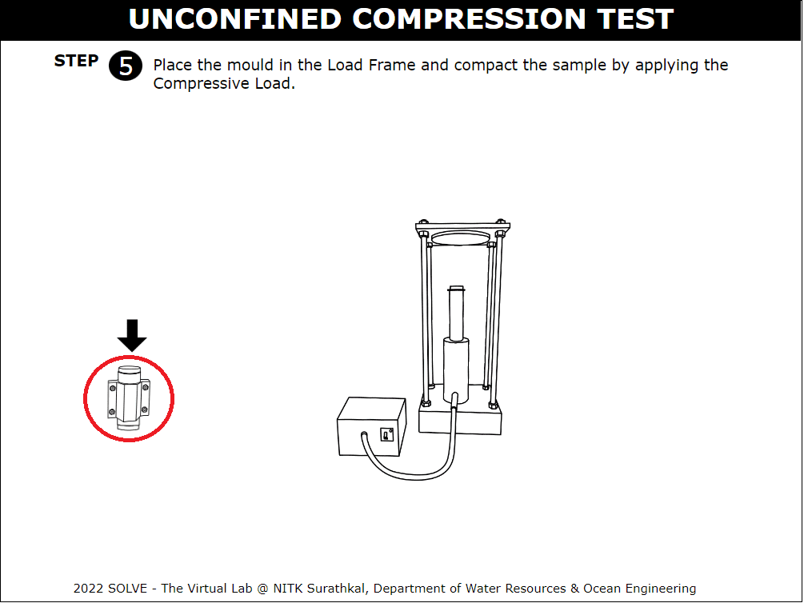
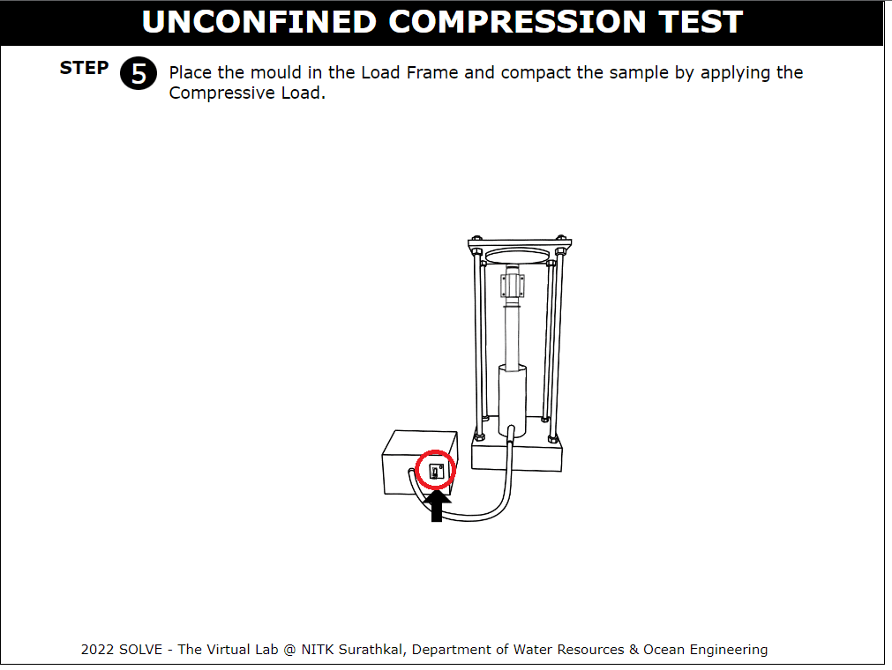
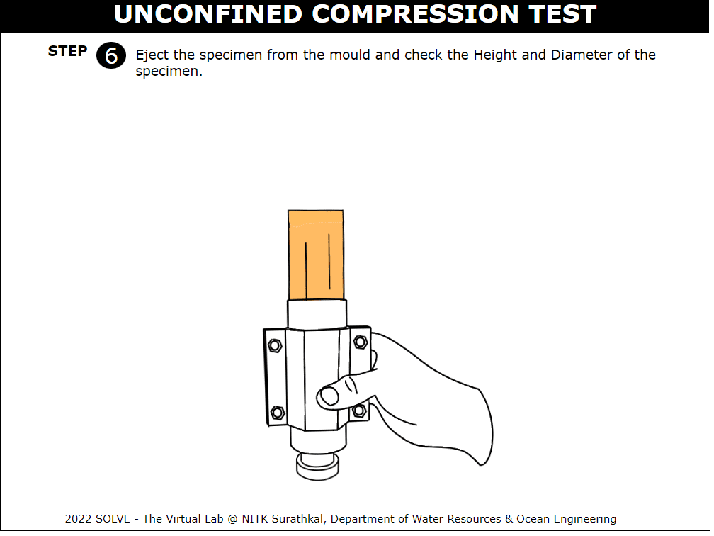
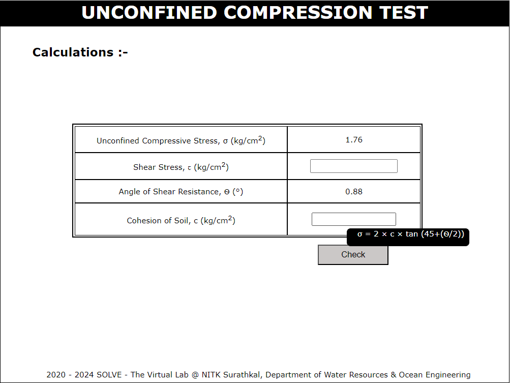
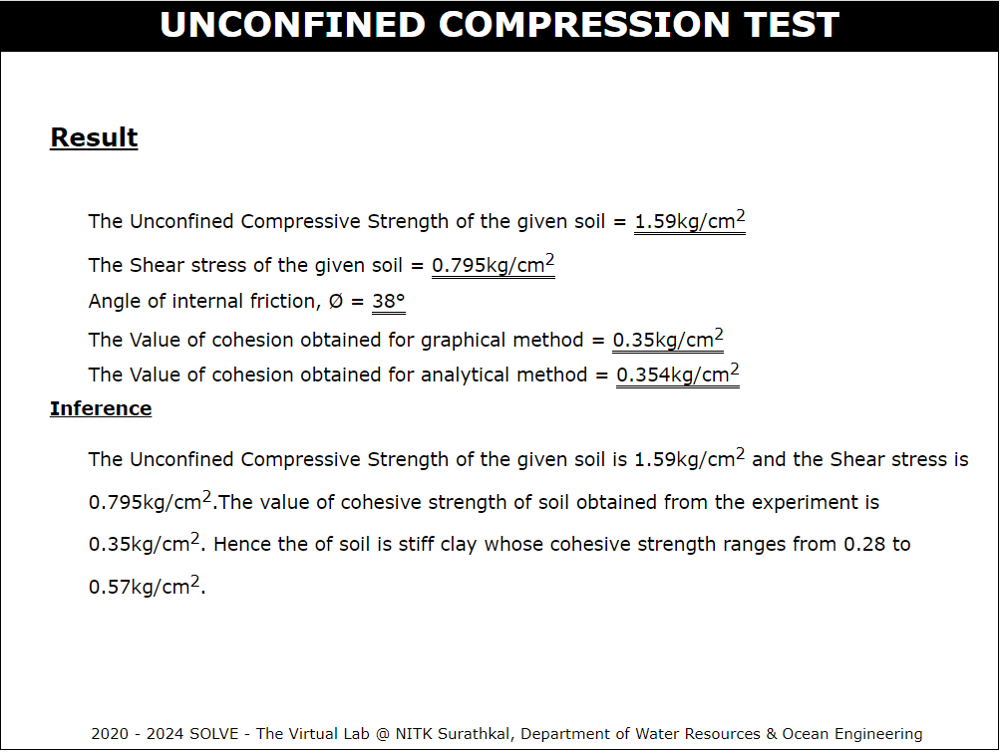

### Procedure

These procedure steps are followed on the simulator.

1. Open the Unconfined compression test. This window will be displayed.

2.  Click on description to know the basic definition of the experiment. Click the next button on the right bottom corner to proceed further.

    

3.  Click on scale to measure diameter and height of the mould.

    

4.  Calculate the parameters required and enter the values. Click on “Check” to verify answer and "Result" to obtain correct answer.

    

5.  Click on the trowel to add soil to the container.

    

6.  Now add measured quantity of water using measuring jar. Mix it thoroughly using straight edge.

    

7.  Click on the bottom collar and fix the collar on the bottom of the mould.

    

8.  Apply the oil on the inner surface of the mould before filling the soil.

    

9.  Click on the bowl containing soil to fill the mould.

    

10. After the mould is filled with soil, click on the top collar to fix it on the top of mould.

    

11. Click on the mould to place it on the load frame, to compact the sample by applying compressive load.

    

12. Switch ON the load frame machine to start the compaction of the mould

    

13. A note on load frame will be displayed.

    

14. Click on the mould to eject the soil sample present inside the mould. Measure the diameter and height of the soil sample using scale.

    

15. Click on the proving ring to fix it on the loading frame.

    

16. Place the soil sample on the loading frame by clicking on sample.

    

17. Click on the Dial Gauge to fix it on the lower plate and lower the upper plate to touch the surface of the specimen.

    

18. Adjust the gear position to zero reading to get vertical displacement.

    

19. Now the load is applied and readings are noted down till the specimen fails.

    

20. Enter the calculated value for the given formula and then click on "Check" and "Result" to get the actual value. Similarly other values are calculated.

    

21. Now calculate the Cohesion of soil using the given formula. Then click on "Check"
    and “Result” to get actual value.

    

22. With the obtained values plot a graph for stress v/s strain curve. To view slope click on "View slope" tab provided below and click on next button to proceed further.

    

23. Cohesion of soil is obtained graphically by Mohr's circle. Click on "Path" tab provided below to get a step by step procedure to plot a graph.

    

24. Result and inference are displayed.

  

