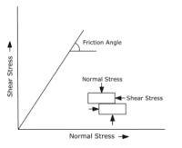
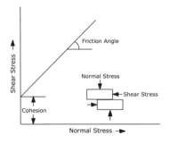

### INTRODUCTION

### Shear strength of soil

 Shear strength is the capacity of soil to withstand the external and internal pressure which acts on the soil. The resistance of soil to any deformation is due to the friction and interlocking between the particles and the bonding of particles with each other. These are known as the shear parameter.

The shear strength parameters are namely:

**1. Cohesion (C):**
   This parameter includes the shear strength of the soil or rock which is independent of any interparticle interlocking or friction and is purely due to the electrostatic forces or cementing property between the particles.

**2. Angle of internal friction (Φ):** Angle of internal friction is a shear strength parameter which deals with the friction and interlocking behaviour of the soil. This is the angle measured between normal force (N) and resultant force (R) that occurs during the time of failure due to exceeding shearing stress.

Graphically, the angle of internal friction for any given soil is the angle of the shear stress and normal effective stress at which shear stress occurs.

#### Types of soil based on Shear parameters :

**1. Cohesive soil (C soil)**: Cohesive soils are fine grained, low strength and easily deformable spills which have a tendency for particles to adhere, i.e., The strength property of this type of soil is purely based on the bonding between particles due to electrostatic forces or cementing and is not related to the interlocking of the particles. Therefore in cohesive soils the strength is purely due to cohesion and angle of internal friction will be zero.                            

   Graphical representation of cohesive soil.

 

**2. Cohesionless soil / Non-cohesive soil (Phi soil):**   Cohesionless soils are any type of free running soils such as sand or gravel. The strength of these types of soils completely depends on the intermolecular friction between the particles and the cohesive force between the particles is zero.

  
Graphical representation of cohesionless soil

 

**3. Cohesive - friction soil (C-Phi soil):**
Cohesive - friction soil is a type of soil where the soil exhibits both cohesive as well as friction properties.    
Thus in these kinds of soil, the strength of the soil is due to the combined effect of the intermolecular interlocking, friction and as well as the bonding between the particles.

  

Graphical representation of cohesive - friction soil

 

### Unconfined compression test
Unconfined compression test also known as uniaxial compression test is a procedure  conducted to determine the shear strength of the soil. The unconfined compression test is the most well known strategy for soil shear testing since it is one of the quickest and least expensive methods for calculating shear strength. The cylindrical specimen of soil is subjected to major principal stress &sigma; at constant rate of strain till the specimen fails due to shearing along a critical plane of  failure. Compressive load per unit required to fail the specimen is called Unconfined compressive strength of the soil.

   

Unconfined compression strength testing apparatus

IS code reference: IS : 2720 (part 10) -1991

#### Cohesive strength for different types of soil :

| Type of soil | Cohesive strength in kPa | Cohesive strength in kg/cm2 |
| :--------------: | :--------------------------: |:-----------------------------: |
| Rock | 10,000 | 101.97 |
| Silt | 75 | 0.76 |
| Clay | 10 to 20 | 0.1 to 0.2 |
| Very soft clay | 0 to 7  | 0 to 0.071 |
| Soft clay | 7 to 14  | 0.071 to 0.14 |
| Medium clay | 14 to 28  | 0.14 to 0.28 |
| Stiff clay | 28 to 56 | 0.28 to 0.57 |
| Very stiff clay | 28 to 110 | 0.28 to 1.12 |
| Hard clay |> 110 | >1.12 |

